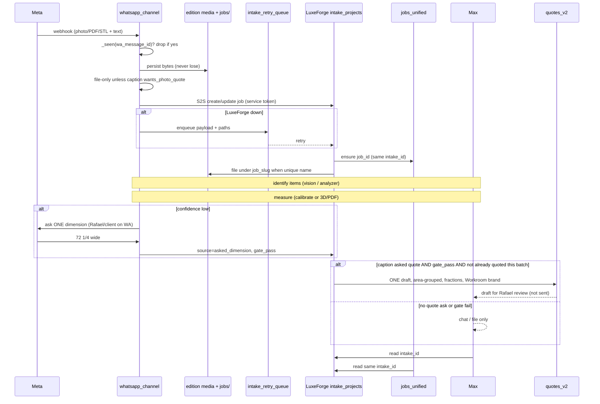

# Design: WhatsApp → LuxeForge central intake

Date: 2026-10-10  
Status: **design only** — Rafael approved the direction. No implementation in this PR.  
Base for this note: `deploy/pr82-84-85`, plus WhatsApp filing rules as fixed in PR #91.

WhatsApp is a capture channel. **LuxeForge is the central intake.** Inbound photos, PDFs, and 3D files (STL, Polycam exports) plus job text become one LuxeForge job record. Max, the job board, and the job folders all read that same record. A draft quote is created only after identify → measure (calibrated reference + confidence gate). Nothing is auto-sent to a client.

---

## 0. Rules (non-negotiable)

1. **No estimate from photos unless explicitly asked** (PR #91): quote words must be in **this photo’s caption / same message**. Nearby “send me a quote for Emma” does not mint drafts.
2. **At most one draft per WhatsApp photo batch.**
3. **Family editions stay isolated** (`EMPIRE_DATA_DIR` / `WHATSAPP_JOBS_ROOT`). Amp and Maxine never see Rafael’s jobs, chats, or intake rows.
4. **No outbound WhatsApp / email / client PDF without Rafael’s yes.** Drafts stay `draft`. Owner mail (`workroom@empirebox.store`) is internal only.
5. **Never lose a file.** Persist on the Max edition first; enqueue if LuxeForge is down; retry. Dedup Meta `wa_message_id` before ingest.
6. **Never auto-create a quote without the measure gate.** Identify and measure first. Low confidence → ask **one** dimension, then continue.
7. **No new public Luxe endpoints.** PR #71 / `docs/LUXE_API_LOCK.md` (repo cites PR 61 for the same gate in `luxe_public_edge.py`) locked `luxe.empirebox.store`. WhatsApp → LuxeForge is **authenticated server-to-server on the private cash path** (localhost / Tailscale / `studio` / `api`).

---

## 1. Current-state audit

Today WhatsApp and LuxeForge are **two production intake paths**. They both can create a `quotes_v2` draft. They do not share a job id.

### What to reuse

| Piece | Path | Reuse how |
| --- | --- | --- |
| WhatsApp webhook, allowlist, 24h window, `_seen` dedup | `backend/app/services/max/whatsapp_channel.py` | Keep as the only Meta ingress. After persist/batch, call the new internal intake writer. |
| Photo batch, job ask, SQLite TTL | `backend/app/services/max/whatsapp_log.py` | Keep file-only default, one ask, `asked==1` gate, expiry on load. |
| Quote gate (caption only, one draft/batch) | `wants_photo_quote`, `mark_photo_batch_quoted` in the two files above; `docs/WHATSAPP_CHANNEL.md` | Do not regress PR #91. |
| Job name resolve | `backend/app/services/max/doc_lookup.py`, `backend/app/config/client_aliases.json` | Unique name → attach to existing job folder + LuxeForge record. Ambiguous/unknown → ask once; do not guess. |
| LuxeForge project row | `backend/app/routers/intake_auth.py` (`intake_projects`: `intake_code`, photos, scans, measurements, `quote_id`, `photo_analysis`) | **This is the central job record.** Extend it; do not invent a third table as the source of truth. |
| Designer submit → Workroom | `backend/app/services/luxeforge_intake_handoff.py` | Reuse attach-files + owner notice. **Do not** call `create_quote` from WhatsApp until the measure gate passes. |
| Shared lead/CRM brief | `backend/app/services/workroom_lead_intake.py`, `POST /api/v1/leadforge/intake` | Optional later: one CRM lead per LuxeForge job. Not required for phase 0. |
| Photo item ID | `backend/app/services/quote_engine/item_analyzer.py`, `backend/app/routers/vision.py` | Identify items from photos. Today WhatsApp jumps from here straight to a quote. |
| Photo → quote lines | `backend/app/services/quote_engine/photo_quote_lines.py` | Use **after** measure. Current WhatsApp `default_photo_handler` skips measure. |
| Calibrate / pixel → inch | `backend/app/routers/luxeforge_measurements.py`, `backend/app/models/luxeforge_measurement.py` | Reuse calibrate + calculate. Wire to the intake attachment, not a loose `image_id`. |
| Fractions (never shop decimals) | `backend/app/services/pricing/dimensions.py` (`format_inches_plain`) | All displayed measurements: `26 3/4"`, not `26.75`. |
| Area-grouped totals, deposit, balance | `backend/app/services/quote_service.py` (`_area_grouped_financials`, `deposit_percent` default 50) | Draft quote columns after the gate. |
| Empire Workroom branding | `backend/app/services/quote_pdf_service.py` (legacy portrait) | Default billed-as / PDF skin. |
| Unified job board | `backend/app/routers/jobs_unified.py`, `backend/app/services/lifecycle_service.py` (`create_job_from_quote`) | Create/link a `jobs_unified` row **from the intake record**, not only after a quote exists. |
| Job folders | `$EMPIRE_DATA_DIR/jobs/<slug>/photos\|received` via `whatsapp_log.file_into_job` | Same slug on the LuxeForge row. |
| Public Luxe lock | `backend/app/security/luxe_public_edge.py`, `empire-command-center/middleware.ts`, `docs/LUXE_API_LOCK.md` | New writer must stay **off** the public allowlist. |
| Founder PIN / founder JWT | `backend/app/accounts/founder.py`, `POST /api/v1/auth/founder-token` | Operator reads (Max, CC, WhatsApp chats). Not the S2S token. |
| Intake JWT | `INTAKE_JWT_SECRET` in `intake_auth.py` | Designer portal only. Do not reuse for Max→LuxeForge. |
| 3D upload extract | `backend/app/routers/photos.py` (stl/glb/usdz/zip) | Store on `intake_projects.scans`. Measure is **not** implemented. |
| WhatsApp Chats UI | `empire-command-center` WhatsApp screen + `GET /api/v1/whatsapp/chats*` | Show the shared `intake_id` / `intake_code`. |
| LuxeForge admin UI | `empire-command-center/app/components/screens/LuxeForgePage.tsx` | Same record. Must send intake JWT (`intakeFetch`); do not add public list APIs. |

### What is missing

| Gap | Why it matters |
| --- | --- |
| WhatsApp never writes `intake_projects` | Files land in inbox/job folders; quotes (when asked) go straight to `quotes_v2` with `customer_name="Photo"`. Max and the board cannot see one job. |
| No internal S2S intake API | Only designer JWT + public capture posts. A WhatsApp worker must not use the public luxe host or the designer JWT. |
| No service token / scopes / rotation | Nothing today is “Max backend, scope `intake:write`”. |
| Measure gate not on WhatsApp | `default_photo_handler` → `analyze_photo_items` → `create_quote`. No calibrated reference, no confidence stop, no “ask one dimension”. |
| `luxeforge_measurements` not bound to intake | SQLAlchemy `luxeforge_image_measurements` is a parallel stack; not the `measurements` JSON on `intake_projects`. |
| Polycam / STL / PDF-plan → dimensions | Files can be stored. There is no extractor that yields width/height/drop with confidence. |
| `jobs_unified` not created from LuxeForge or WhatsApp | Handoff sets `quotes_v2` only. `create_job_from_quote` is a later operator click. |
| Job folder ≠ DB job ≠ intake id | Three identifiers. Design: one `intake_id` + `intake_code`, folders keyed by `job_slug`, board keyed by `job_id`, all stored on the intake row. |
| No durable retry queue | If LuxeForge/DB is down, WhatsApp persist can succeed and the intake write is lost. |
| Owner list API on public luxe | `GET /api/v1/intake/owner/submissions` is denied and not implemented. Keep it that way. |
| Area-grouped **line** columns Rafael listed | Financial split exists; the per-area table (Description, Qty, Unit, Sq ft/item, Price/sq ft, Total, area subtotal) is not a single WhatsApp/intake schema. |

### Parallel sinks (do not add a fourth “source of truth”)

1. `intake_projects` — LuxeForge (chosen hub)  
2. WhatsApp SQLite + `whatsapp/inbox/` — channel log + parked bytes  
3. `quotes_v2` — drafts after the gate  
4. `jobs_unified` — board, linked from intake  
5. `lf_leads` / CRM — optional later  

---

## 2. Data model

**Hub: `intake_projects` (LuxeForge job).** Additive columns; do not break designer portal.

### Job record (`intake_projects` extensions)

| Field | Purpose |
| --- | --- |
| `id` | UUID hub key (`intake_id`). Max, board, folders, chat log store this. |
| `intake_code` | Human id (`LF-YYYY-NNN`). |
| `edition` | `EMPIRE_DATA_DIR` key. Family isolation. |
| `source` | `whatsapp` \| `designer_portal` \| `leadforge`. |
| `status` | `received` → `identified` → `measuring` → `measured` → `quote_draft` → (Rafael) `quoted`. Never `sent` from automation. |
| `job_slug` | Existing folder under this edition’s jobs root, or empty until named. |
| `job_id` | `jobs_unified` id (created in phase 1). |
| `quote_id` / `quote_number` | Set **only** after measure gate. |
| `wa_id` | Sender. |
| `wa_batch_id` | Open/closed WhatsApp media batch. |
| `customer_name`, `address`, `treatment`, `notes` | From portal or `doc_lookup` / caption. |
| `business` | Default `workroom`. |

### Attachments (child table `intake_attachments`, new)

Do not only stuff JSON `photos`/`scans` if we need retry and confidence.

| Field | Purpose |
| --- | --- |
| `id` | Attachment id. |
| `intake_id` | Hub. |
| `kind` | `photo` \| `pdf` \| `stl` \| `polycam` \| `other`. |
| `sha256` | Dedup + never-lose. |
| `local_path` | Edition media or job folder path. |
| `wa_message_id` | Meta id; unique per edition. |
| `whatsapp_attachment_id` | Row in `whatsapp_attachments`. |
| `filing_status` | `inbox` \| `filed`. |
| `identify_json` | Item analyzer output. |
| `identify_confidence` | `high` \| `medium` \| `low`. |

### Measurements (child `intake_measurements`)

| Field | Purpose |
| --- | --- |
| `intake_id`, `attachment_id`, `item_index` | Link. |
| `source` | `calibrated_photo` \| `asked_dimension` \| `stl` \| `polycam` \| `pdf_plan` \| `manual`. |
| `width_in`, `height_in`, `depth_in` / `drop_in` | Stored as rational sixteenths (integer 1/16ths) or text fractions. **Display via `format_inches_plain` only.** |
| `area_sqft` | Derived after both plan dimensions exist. |
| `confidence` | 0–1 plus `high/medium/low`. |
| `reference` | `{label, pixels, real_in}` from `luxeforge_measurements.calibrate`. |
| `asked` | True if this value came from the one WhatsApp dimension question. |
| `gate_pass` | True only when confidence ≥ threshold **or** Rafael/asked dimension filled the hole. |

### Quote drafts

Reuse `quotes_v2` + `quote_line_items`. Create only when every priced item has `gate_pass`.

**Area-grouped columns (Rafael):** group by area/room, then:

| Column | Notes |
| --- | --- |
| Description | Identified item + location |
| Qty | Integer |
| Unit | e.g. panel, pair, sq ft |
| Sq ft per item | Fraction-backed area |
| Price per sq ft | Rate card |
| Total | qty × sq ft × rate (or unit price) |
| Subtotal per area | After the group |
| Grand total | After all areas |
| Deposit | Default 50% unless Rafael changes |
| Balance | Grand − deposit |

Branding: **Empire Workroom** by default (`quote_pdf_service` legacy path / `business_unit=workroom`).

### Links (all stored on the hub row and mirrored)

```
intake_id ──┬── jobs_unified.job_id
            ├── jobs_root / <job_slug> / {photos,received,scans}
            ├── quotes_v2.id          (after gate)
            ├── whatsapp_messages.id + whatsapp_attachments.id
            └── lf_leads.id           (optional)
```

Max tools (`get_quote`, `set_current_job_id`, open job) resolve `intake_id` first, then the linked quote/folder.

---

## 3. Auth (Max backend → LuxeForge)

Public luxe already allows anonymous `POST /api/v1/intake/signup|login` and `POST /api/v1/leadforge/intake`. **Do not put WhatsApp ingest on those paths.** A stolen public form must not be able to write Rafael’s jobs.

### Endpoint (private only)

```
POST /api/v1/internal/luxeforge/jobs          create/update job
POST /api/v1/internal/luxeforge/jobs/{id}/attachments
POST /api/v1/internal/luxeforge/jobs/{id}/measurements
GET  /api/v1/internal/luxeforge/jobs/{id}     Max / board / tests
```

- Prefix `/api/v1/internal/` is **denied** on `luxe.empirebox.store` / `test-luxe` (add to `_BLOCKED_PREFIXES` in `luxe_public_edge.py` and Next middleware).
- Listen only on the process already behind Access / Tailscale / localhost.
- No CORS for browsers. No cookies.

### Service token

| Item | Spec |
| --- | --- |
| Env | `LUXEFORGE_INTAKE_SERVICE_TOKEN` (random 32+ bytes). Optional `LUXEFORGE_INTAKE_SERVICE_TOKEN_PREVIOUS` for rotation overlap. |
| Header | `Authorization: Bearer <token>` plus `X-Empire-Service: max-whatsapp` |
| Compare | `hmac.compare_digest` of SHA-256 hashes; never log the token. |
| Scopes | `intake:write`, `intake:attach`, `intake:measure`, `intake:read`. WhatsApp worker gets write+attach; measure worker gets measure; Max read tools use founder PIN **or** `intake:read`. |
| Rotation | Deploy new token to `TOKEN` and old to `TOKEN_PREVIOUS`. Restart Max worker then intake. After 24h drop previous. One token per edition if family boxes share code (different env). |
| Not | Designer `INTAKE_JWT_SECRET`, `FOUNDER_PIN`, Graph WhatsApp token. |

If the token is missing, the writer is disabled; WhatsApp still persists files and enqueues.

---

## 4. Flow



Identify / measure run on the Max worker against private APIs. WhatsApp replies for “which job?” and “what is the width of the left panel?” stay in-window text. They are not quotes.

---

## 5. Failure behavior

| Case | Behavior |
| --- | --- |
| **Low confidence** | Do not draft. Ask **one** dimension (the missing plan measure: usually width **or** height/drop — not a questionnaire). Store answer as `source=asked_dimension`. If still blocked, leave status `measuring` and tell Rafael in Max. |
| **Unknown / ambiguous job** | PR #91: park inbox, ask once. Create the LuxeForge row anyway (`job_slug` empty). Unique reply files the batch and sets `job_slug`. `hello` / schedule / unresolved text → Max chat, not a second ask. |
| **Duplicate Meta delivery** | `_seen(wa_message_id)` before persist/batch (PR #91). S2S upsert on `(edition, wa_message_id)` / sha256. Second delivery is a no-op. |
| **LuxeForge down** | Bytes already on disk. Insert `intake_retry_queue` (`payload_json`, `path`, `attempts`, `next_run`). Worker retries with backoff (1m / 5m / 30m / 2h). Dead-letter after N tries → Max alert. **Do not drop the file.** |
| **Identify fails** | Status stays `received`. File is kept. No quote. |
| **3D / PDF extract gap** | See §5.1. File is attached. Measure `source` stays empty; gate fails; no quote. |
| **Quote path** | Never `send_quote`, never Graph document to the customer, never client email. |
| **Caption did not ask** | No quote, even if measure is perfect. |
| **Second photo in a quoted batch** | File + attach only. |

### 5.1 Polycam / STL / PDF-plan extraction gaps (honest)

| Source | What we can store today | What we cannot do yet |
| --- | --- | --- |
| **Photo + known reference** (door, outlet, tape) | Vision prompts mention references (`vision.py`). Interactive calibrate exists (`luxeforge_measurements.py`). | No automatic “this is a 36" door → scale the window” with a stored confidence that the quote gate trusts. |
| **Photo, no reference** | Item labels (roman, panel, sofa). | Real-world inches. Must ask one dimension or wait for a calibrated photo. |
| **Polycam export** (USDZ/OBJ/GLB/ZIP) | `photos.py` unzip + `intake_projects.scans`. UI copy in Photo Analyzer. | No mesh → opening size pipeline. No unit metadata guarantee (meters vs inches). No confidence. |
| **STL** | Stored; CraftForge has STL fields (`craftforge.py`) for a different product. | No bounding-box → Workroom width/height/drop. Facet scale often unitless. |
| **PDF plan / shop drawing** | Bytes in `received/`. `notes_extraction.py` is handwritten notes, not scale drawings. | No title-block scale, no dimension-string OCR tied to an opening. |

Until an extractor exists for a kind, that attachment **cannot** pass the measure gate by itself.

---

## 6. Phases (each independently shippable)

### Phase 0 — Smallest useful step

WhatsApp batch (after persist) S2S-creates or updates one `intake_projects` row with source `whatsapp`, attachments on disk, `wa_message_id` dedup. No quote. No public endpoint. If LuxeForge errors, queue + retry. Max can `GET` the job by `intake_id` with founder PIN **or** service `intake:read`.

**Done when:** a mocked webhook of 3 photos + “Maggie” yields one intake row + files under `maggie-frolich`, and a second identical `wamid` does not create a second row.

### Phase 1 — One record everywhere

Write `job_id` (`jobs_unified` status `intake`) and `job_slug` on the hub. Job board card and WhatsApp Chats show `intake_code`. Folder writes stay edition-scoped.

**Done when:** opening the board card, the folder, and Max “open this job” all resolve the same `intake_id`.

### Phase 2 — Identify + measure gate

Run item analyzer; persist confidence. For photos, require calibrate **or** one asked dimension. Do not call `create_quote`.

**Done when:** low-confidence fixture asks once and does not mint `quotes_v2`; high-confidence + reference reaches `measured`.

### Phase 3 — Draft quote after the gate

If and only if caption asked **and** batch not yet quoted **and** `gate_pass`: one `quotes_v2` draft, area-grouped columns, plain fractions, Empire Workroom, `not sent`.

**Done when:** existing PR #91 tests still pass, plus a new test that measure-fail blocks `create_quote`.

### Phase 4 — 3D / PDF extractors (optional, separate)

Polycam/STL bounding box and PDF dimension strings, each with confidence. Until then those files remain attachments only.

---

## 7. Tests per phase (mocks only)

No live Graph, no live `EMPIRE_DATA_DIR`, no live `client_aliases.json` (stub `MAX_CLIENT_ALIASES_PATH` as in WhatsApp tests). No writes to `~/empire-data`. Reuse `tests/_live_data_guard.py`.

| Phase | Tests |
| --- | --- |
| 0 | S2S 401 without token; 403 on forged `Host: luxe.empirebox.store`; create job from mocked webhook; duplicate `wamid` no-op; LuxeForge 503 → queue row + file still on disk; family `EMPIRE_DATA_DIR` cannot read the other edition’s intake. |
| 1 | Hub has `job_id` + `job_slug`; board GET and WhatsApp message metadata share `intake_id`. |
| 2 | High confidence + reference → `measured`; low confidence → one ask, no quote; skip/hello still fall through (PR #91). |
| 3 | Caption quote + gate → **one** draft; nearby quote text + 7 photos → 0 drafts; second captioned photo in batch → 0 extra drafts; fractions in line text (`3/4`, not `0.75`); `create_quote` not called when gate fails. |
| 4 | STL/Polycam/PDF attach without extractor → `gate_pass=false`. |

---

## 8. Open questions for Rafael

1. **When is a LuxeForge job created?** Every inbound photo/PDF/3D batch, or only when the caption asks for a quote / a job name is known? (Recommendation: every fileable batch, so the board sees work even when it is file-only.)
2. **Confidence number.** What is “low”? Start at `< 0.75` or vision `low`/`medium`?
3. **Which single dimension** do we ask first (width vs drop vs height)? Per treatment?
4. **Who is the intake user** for WhatsApp rows — a system `whatsapp@empire` user, or Rafael’s operator account?
5. **Deposit** still 50% on these drafts?
6. **Should phase 0 also write a LeadForge/CRM lead**, or wait until Rafael converts the draft?
7. **Polycam/STL:** block the quote until a photo measure exists, or allow Rafael to type sizes and skip 3D extract?
8. **Job code vs EST number.** Keep `LF-YYYY-NNN` on the hub and EST only after the gate?
9. **Ask the WhatsApp sender** for the missing dimension, or only Rafael/Max?
10. **McLean-style area groups** — is the column set above (sq ft × price/sq ft) the default for drapery **and** upholstery?

---

## 9. Out of scope / do not do

- Merge or deploy this design.  
- New routes on `luxe.empirebox.store`.  
- Auto-send quotes, invoices, or WhatsApp documents to clients.  
- Delete or reuse EST-2026-300..306.  
- One shared jobs tree across editions.  
- Multiple inbound WhatsApp workers on one edition DB (PR #91 single-worker).  
- CraftForge / LLC Factory as the hub (different products).  

---

## Pointers

- WhatsApp spec: `docs/WHATSAPP_CHANNEL.md`  
- Public lock: `docs/LUXE_API_LOCK.md`  
- Designer → Workroom: `docs/WORKROOM_LEAD_INTAKE.md`, `luxeforge_intake_handoff.py`  
- Quote fractions: `backend/tests/test_measurement_fractions_rule.py`  
