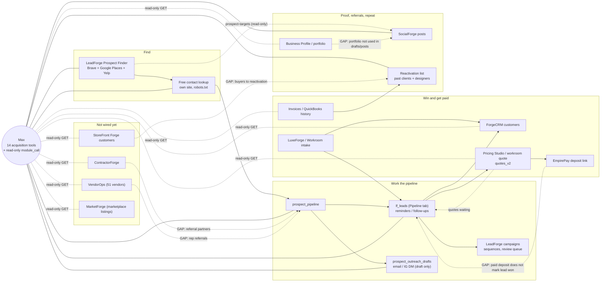

# Client acquisition: ecosystem map and gap analysis (Oct 4, 2026)

Scope: Empire Workroom / LuxeForge client acquisition, from finding a prospect to a paid deposit.
Companion docs: `docs/MAX_PROSPECTING.md` (Max tools), `docs/leadforge/ecosystem.mmd` (diagram source).
Rule for everything here: **outreach is draft-only**. Max drafts. Rafael approves and sends.

## 1. Ecosystem map

| Module | Wired to acquisition today? | Data it could feed | Cheapest link |
|---|---|---|---|
| LuxeForge / Workroom intake | **Yes.** `submit_intake` writes `lf_leads` + CRM | Inbound leads with source/UTM | Done. Inbound leads now get the same reminders |
| ForgeCRM | **Yes.** `/leads/{id}/promote`. Prospect → lead → CRM now works (bug fixed) | Customer master, source, history | Done |
| Business Profile / portfolio | No | Brand voice, social handles, project photos for drafts and proof posts | Read `business_profiles` in `compose_message` and in the social draft tool (small) |
| ContractorForge (construction) | No | GC / builder partners (referral sources) | Add a "contractors" segment that unions `cf_contractors` (small) |
| VendorOps | No (51 vendors) | Fabric/hardware reps who refer designers | Tag reps as referral partners. Show them in the reactivation list (small) |
| Past quotes / invoices / QuickBooks | **Now yes.** Reactivation list and "quotes waiting" reminders | Repeat clients, lapsed designers, unanswered quotes | Done (only 2 paid invoices on file; QuickBooks history and revenue rows fill the gap) |
| Pricing Studio / workroom quote | Partial. Lead → workroom quote exists for workroom leads | Quote value for pipeline value / ROI | Store quote total on the lead (small) |
| EmpirePay | Partial. `deposit_pay_link` exists | Deposit paid = won + revenue | Payment webhook → set lead status `won` + value (small, needs test with Stripe test mode) |
| StoreFront Forge | No | Online buyers (`sf2_customers`) for repeat offers | Add as a reactivation source (small) |
| SocialForge | Partial. Reads `/socialforge/prospect-targets`; Max can now save **draft** posts | Proof posts, engage list | Done (draft-only). Data path gap below |
| MarketForge | No (marketplace listings and products only; no campaigns) | Not an acquisition channel for trade clients | Leave as is; segments endpoint replaces "target pipeline segments" |

Data-path gap: SocialForge stores posts in `~/empire-repo/backend/data/socialforge`, which points at the
other checkout (`/data/empire/repos/empire-repo`), not `empire-repo-main`. Max's draft posts go through the
live API, so they land where the live SocialForge reads. Two checkouts sharing one JSON store is fragile.

## 2. Gap analysis by acquisition step

| Step | Status | Max can use it now? | What would make it best-in-class |
|---|---|---|---|
| Finding prospects | **Exists** (Brave/Google/Yelp, DMV expansion, dedupe, 383 prospects) | Yes: `prospect_search` | Weekly scheduled runs per segment; more target types (architects, property managers, hotels, stagers); "lookalikes of best clients"; Google Place Details for website and phone (paid, below) |
| Enrichment | **Partial → built today** (free own-site lookup + 1 Brave query to find a missing website) | Yes: `prospect_enrich` | Free MX check on found emails; paid fallback (Hunter/Apollo) only for top-scored prospects; re-check every 90 days |
| Scoring | **Exists** (listing score) + new `outreach_score` (contact, IG, fit, DMV) | Yes: `prospect_rank` | Learn from outcomes: weight by won/lost per segment once there are ~30 outcomes |
| Outreach drafts | **Exists** (campaign drafts) + new prospect drafts (email / IG DM) | Yes: `prospect_draft_outreach` (draft-only) | Personalize from the prospect's About page and a matching portfolio photo; one approval queue across campaign and prospect drafts |
| Follow-up sequences | **Partial.** Campaign sequences and `/leads/followups/queue` exist; today added reminders on every pipeline lead, 2-day first-contact reminder, quotes-waiting list | Yes: `pipeline_followups`, `set_followup`; brief includes reminders | Auto-move enrollments when a reply is detected (Gmail thread match); one place for campaign steps and lead reminders |
| Social proof posting | **Partial.** SocialForge posts exist; nothing links finished jobs to posts | Yes, as drafts: `socialforge_draft_post` | "Job complete → draft before/after post" with photos from the job and the client's OK; review-request draft after install |
| Referral and repeat reactivation | **Missing → built today.** Reactivation list (paid invoices, accepted quotes, revenue, QuickBooks history, designers/trade) with suggested text; referral-sources report | Yes: `reactivation_list` | `referred_by` field on leads/customers; thank-you/referral credit tracking; quarterly designer check-in drafts |
| Intake → quote → deposit | **Partial.** Intake, workroom quote and deposit link exist | Yes (existing tools: lead promote, workroom quote, `deposit_pay_link`) | Auto-advance lead status on quote sent / deposit paid (small hook, below) |
| Attribution and ROI | **Partial.** Source/UTM on leads and customers, source/conversion reports | Read-only via `module_call` + `referral-sources` | Join paid invoices to lead source; manual monthly spend per channel; cost per won job; call tracking (paid) |

## 3. Built today (cheap, high value)

- Max can call **every backend module** read-only: `module_catalog` lists the live OpenAPI, `module_call` does a GET.
  Paths that send, sync, pay, connect, log in, delete, or touch tokens/secrets/env/shell are blocked.
- Follow-up reminders on pipeline items: `GET /api/v1/leads/followups/due`, `POST /api/v1/leads/{id}/followup`,
  Follow-ups tab panel with +2 days / +1 week, quotes-waiting list. Adding a prospect to the pipeline sets a 2-day
  "First contact" reminder.
- Reactivation list: `GET /api/v1/leads/reactivation` (filters test, mock, fictional 555 numbers and self records).
- Referral sources: `GET /api/v1/leads/reports/referral-sources`.
- SocialForge proof posts as drafts: Max tool `socialforge_draft_post` (status forced to `draft`).
- Free contact lookup, outreach score, prospect drafts, daily brief, segments, social targets (see MAX_PROSPECTING.md).

## 4. Needs approval (paid APIs or bigger builds)

| Item | What it adds | Rough cost |
|---|---|---|
| Google Place Details (website + phone fields) | Fills the main data gap: Google rows have no website or phone | About 1,000 free calls/month on current pricing, then about $20 per 1,000. Our volume (a few hundred new prospects a month) is likely $0-10/month |
| Hunter.io | Email finder and verifier for top prospects | Free 50 credits/month; Starter about $49/month (about $34 billed yearly) |
| Apollo.io | People and email data (owner names) | Free tier with limited credits; Basic about $49-59 per user per month |
| Email verification service (ZeroBounce or similar) | Lower bounce rate before Rafael sends | Roughly $10-20 per 1,000-2,000 checks, pay as you go |
| Separate sending mailbox/domain for cold email | Protects the main domain's reputation | Domain about $12/year + Workspace mailbox about $7-8/month, plus 2-3 weeks of warm-up |
| Call tracking (CallRail or similar) | Phone-call attribution per channel | About $45+/month |
| Instagram DMs via Meta API | Not possible for cold outreach: the API only allows replies inside 24h after the person writes first. IG DMs stay copy-and-send from the phone | $0, policy limit |
| Approval queue with one-tap send through the existing Gmail gate | Rafael approves drafts in one place; still nothing sends without a tap | Medium build (2-3 days) |
| Deposit paid → lead won + revenue on lead (EmpirePay webhook) | Closes the funnel; enables real ROI | Small build (half a day) plus Stripe test-mode check |
| ROI dashboard (spend entry + invoice/source join) | Cost per lead / per won job by channel | Medium build (1-2 days) |
| Job complete → before/after proof post drafts | Steady social proof from real jobs | Medium build (1-2 days; needs photo selection and client consent flag) |
| Scheduled weekly prospect runs + morning brief to Rafael (Telegram) | Hands-off top-of-funnel | Small build, but it sends a message to Rafael, so needs his OK on channel and time |
