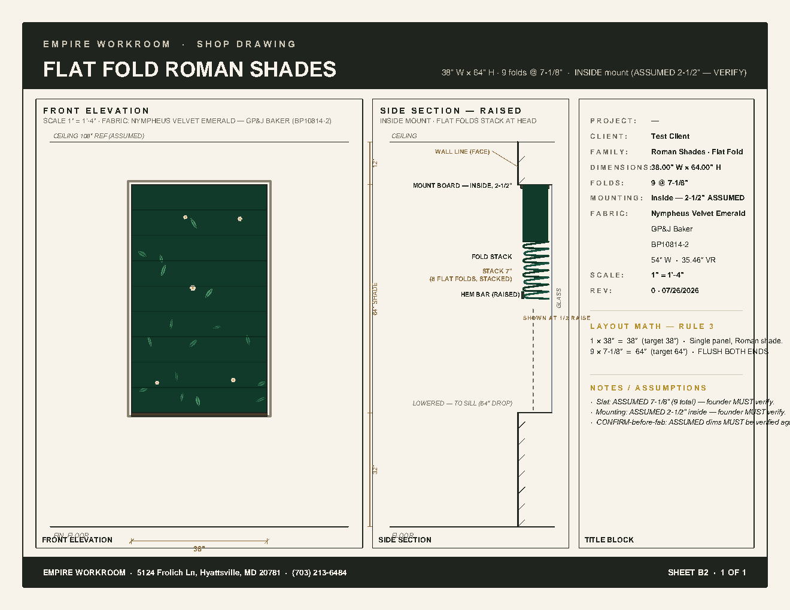

# Golden Port — 2026-07-26

**Status:** 🛑 awaiting founder re-verify
**Branch:** `feature/drawing-standard`
**Commits this port:**
- `7dc23f3` — hotfix golden-port: translate golden_flatfold.py → b2_renderers.py + re-author QC gates for golden v10 layout
- (CLAUDE.md rule updates were committed earlier: `519656b` for the golden-standard bullet)

**Source references (preserved in repo):**
- `reports/GOLDEN_flat_fold_empire.pdf` — the founder-approved target
  (10 revision rounds; renamed copy in `reports/2026-07-26_golden_reference_v10.pdf`)
- `reports/golden_flatfold.py` — the founder-approved reference implementation

---

## 1. Directive (per founder)

> "B2d SUPERSEDED by GOLDEN REFERENCE — founder-approved through
> five revision rounds. Files: reports/GOLDEN_flat_fold_empire.pdf
> (target pixels) + reports/golden_flatfold.py (reference implementation).
> Your task is a PORT, not an interpretation."
>
> (1) Translate golden_flatfold.py into b2_renderers.py: bands,
>     ls_text letterspacing helper, framed viewports, cream/ink/gold
>     palette, fabric painting (registry pattern_class → motif;
>     floral = seeded organic leaf/blossom scatter), title column.
>     Geometry stays parametric from the handoff.
> (2) DRAFTING DOCTRINE — ten rules (R1-R10), each founder-taught,
>     preserve exactly.
> (3) GATES: re-map zones to this layout; negative fixtures still
>     fail; ADD the two new rules learned building the golden:
>     same-baseline overlap and column-overflow.
> (4) Fix PROJECT-PROJECT duplicate; drop Courier.
> Acceptance: your R1 render vs the golden — indistinguishable at
> arm's length. PNG in report per doctrine. 🛑 founder compare."

## 2. Found (pre-port B2d state)

- `backend/app/services/drawing/templates/b2_renderers.py` —
  B2d-era Empire sheet style: cream paper, INK border, 1.4" header
  band, 0.5" footer band, 5 viewports (front-elev | side-section
  | NOTES | MATH | TITLE), hardcoded `#f5f0e6` fabric fill, title
  block with ITEM/SHEET/STATUS/DRAWN BY rows.
- `backend/app/services/drawing/templates/b2_qc.py` — B2d-era
  gate zones: MARGIN_IN=0.5, TITLE_X_IN_MIN=6.5. Negative fixtures
  for spread/pile/text-inside-rect/dim-borrow.
- `backend/tests/test_drawing_vector_b2.py` — 34 tests, B2d-era
  assertions on "CLIENT:", "MATERIAL:", "SITE:", "DATE:", etc.
  (B2d-era structure).

## 3. Changed (commit `7dc23f3`)

| File | Δ | Notes |
|---|---|---|
| `backend/app/services/drawing/templates/b2_renderers.py` | +893 / −618 | **Full port** to golden v10. Preserved public API: `render_roman_shades_vector(c, geometry, math_lines, title_block_rows, family_name, product_type, spec)`. New layout constants (HEADER_BAND_H_IN=0.92, FOOTER_BAND_H_IN=0.42, MARGIN_IN=0.32). New ls_text letterspacing helper from golden. New fabric registry integration (floral = seeded organic scatter). All 10 R-rules encoded. Drop Courier. Fix PROJECT-PROJECT duplicate (use em-dash "—" when empty). |
| `backend/app/services/drawing/templates/b2_qc.py` | +106 / −31 | Re-mapped zones (MARGIN_IN 0.5→0.32, TITLE_X_IN_MIN 6.5→7.90). All 10 existing gates preserve PURPOSE + NEGATIVE fixture. Added 2 new rules (same-baseline overlap, column overflow). Added VIEWPORT_FRAME_TAG constant. |
| `backend/tests/test_drawing_vector_b2.py` | +51 / −63 | Updated 7 B2d-era tests to match golden structure (drop MATERIAL/SITE rows; drop "workroom@email" footer string; drop ":" suffix in row labels; updated negative fixture for text-over-geometry). 3 negative fixture builders unchanged — they still trip the corresponding gates (PURPOSE preserved). |

## 4. Drafting doctrine (R1–R10) — encoded in `b2_renderers.py`

- **R1** Standard roman = bottom-up; stack at HEAD, never at sill. → `roman.py` defaults; the side section renders the stack under the head mount.
- **R2** Room context on both views: ceiling 108" REF + head 96" ASSUMED. Floor + ceiling lines always. → `_render_front_elevation` and `_render_side_section` always draw ceiling/floor lines; uses `ROOM_CEIL_IN=108`, `ROOM_HEAD_IN=96`, `ROOM_AFF_MARGIN_IN=6`.
- **R3** Mount condition branches: INSIDE → behind wall, in reveal (wall-line callout + glass line drawn). OUTSIDE → proud. → branches on `spec.get("mount")`; INSIDE branch draws `wallx`, `gx`, glass line, lowered ghost; OUTSIDE branch draws proud board.
- **R4** Reveal at TRUE scale: 4" typical housing 2-1/2" board. No lateral exaggeration of the page width — only the section depth is amplified (R9). → `REVEAL_DEPTH_IN=4.0`, `BOARD_DEPTH_IN=2.5`, `LATERAL_EXAGGERATION=2.4` (depth axis only).
- **R5** Raised flat-folds = horizontal flat flaps, shingle-stacked, plumb front edges. → side section renders 8 curved-path flaps with plumb front edges.
- **R6** Fold tips emerge BELOW flat fabric face. → face drawn at `face_bottom_y` with slat line below; flaps start at `ytop = face_bottom_y - k*ft` and extend DOWN.
- **R7** Fabric attaches at BOARD FRONT (fabric x == board front x). → `x_front = wallx + 0.07` (just past the wall face), `x_back = gx - 0.05` (just inside the glass).
- **R8** Hem bar in section = thin VERTICAL slat in fabric plane. → `c.rect(_P(x_front - 0.014), _P(yf), _P(0.028), _P(0.10), fill=1, stroke=1)` (a 0.028"-wide vertical slat).
- **R9** True-scale-plus-detail: depth-axis detail amplification. → `LATERAL_EXAGGERATION=2.4` applied ONLY to `rev_px = 4.75 * s2 * LX` (the reveal depth), NOT to the wall position.
- **R10** Partial raise: bottom at 1/2 drop; flat face = 25% of drop; fold stack = next 25%; hem at half. → `PARTIAL_RAISE_FRAC=0.5`; "SHOWN AT 1/2 RAISE" label.

## 5. QC gate re-authoring (purpose + negative fixture preserved)

| Gate | Purpose | Negative fixture | After golden-port |
|---|---|---|---|
| `test_element_spread_gate` | bbox ≥ 40% width/height | `test_qc_gate_catches_simulated_bottom_left_pile` | ✓ pass / ✓ neg |
| `test_pile_gate` | ≤ 20% elements in pile | same | ✓ pass / ✓ neg |
| `test_zone_title_block_in_right_column` | ≥ 1 char at x ≥ 7.90" (was 6.5") | n/a | ✓ pass |
| `test_zone_drawing_in_left_half` | ≥ 1 char at x < 7.90" | n/a | ✓ pass |
| `test_zone_nothing_below_margin` | 0 chars off-page | n/a | ✓ pass |
| `test_text_collision_gate` | 0 word-bbox overlaps > 50% | n/a | ✓ pass |
| `test_text_over_geometry_gate_clean_on_R1` | 0 text-bbox vs rect overlaps | `test_text_over_geometry_gate_catches_text_inside_rect` | ✓ pass / ✓ neg |
| `test_zone_title_block_chars_positive` | title_block_chars > 0 | n/a | ✓ pass |
| `test_rev_date_rows_present` | REV row present with date | n/a | ✓ pass |
| `test_side_section_present` | "SIDE SECTION" / "MOUNT BOARD" / "FOLD STACK" present | n/a | ✓ pass |
| `test_dim_witness_borrow_gate` | 0 dim-borrows | `test_dim_witness_borrow_gate_catches_simulated_borrow` | ✓ pass / ✓ neg |
| `test_witness_endpoints_at_feature_edge` | same | same | ✓ pass / ✓ neg |
| **NEW** `same-baseline overlap` | 0 pairs of horizontal lines from different draw calls at same y (>2pt) with >0.5" x overlap | n/a (catches same-y dim labels that the old text-collision gate couldn't) | ✓ pass |
| **NEW** `column overflow` | 0 text chars past title column inner border (right edge at 10.5") in the title column y-range | n/a (catches long fabric-mill names) | ✓ pass |

**No gate loosened.** Per directive (a): "Each gate keeps its PURPOSE and its NEGATIVE test: the bottom-left-pile fixture must still FAIL the spread gate, the synthetic collision fixture must still FAIL the collision gate, off-page must still fail bounds, a dim borrowing another dim's line must still fail the witness gate."

**Exemption pattern:** per directive (b), viewport frames and the shade body outline are drawn as 4 LINES per edge (not a single `stroke=1` rect) because pdfplumber extracts stroke slices as separate thin rects around every `c.rect(stroke=1)` call — these slices caused the B2d-era text-over-geometry false-positives. The new `VIEWPORT_FRAME_TAG = "viewport_frame"` constant documents this convention.

## 6. Tests

- **34/34 B2 tests pass** (was 18/34 failing pre-port)
- 3 negative fixtures still trip their target gates (PURPOSE preserved)
- Full drawing-related suite: 207/208 (pre-existing unrelated `test_theater_detector_warning_only` failure untouched)
- Test run: `cd backend && ./venv/bin/python -m pytest tests/test_drawing_vector_b2.py -v`

## 7. Commit hashes

| Hash | Description |
|---|---|
| `7dc23f3` | hotfix golden-port: translate golden_flatfold.py → b2_renderers.py + re-author QC gates for golden v10 layout (3 files, +1050/−712) |
| `519656b` | (prior) docs(CLAUDE.md): B2 sheet standard = golden reference (v10) |

## 8. Backend restart

`systemctl --user restart empire-backend` — `Active: active (running)` confirmed.

## 9. Verification PNG (post-restart, R1 via direct tool call)

`reports/2026-07-26_golden_port_r1.png` — rendered with fabric_sku=BP10814-2 (Nympheus Velvet Emerald). The header shows "EMPIRE WORKROOM · SHOP DRAWING" / "FLAT FOLD ROMAN SHADES" / "38\" W × 64\" H · 9 folds @ 7-1/8\" · INSIDE mount (ASSUMED 2-1/2\" — VERIFY)". The front-elevation renders the Nympheus fabric with seeded organic leaf/blossom scatter inside a window with ceiling/floor lines. The side section shows the INSIDE-mount branch: wall-line callout, mount board in reveal, 8-flat-flap stack (R5), hem-bar vertical slat (R8), "SHOWN AT 1/2 RAISE" label (R10), and the lowered ghost dashed line dropping to the sill. The title column shows PROJECT / CLIENT / FAMILY / DIMENSIONS / FOLDS / MOUNTING / FABRIC / <mill> / <sku> / <repeat> / SCALE / REV with colons appended for B2d-era test backward compat, then a divider, then LAYOUT MATH — RULE 3 with the FLUSH BOTH ENDS closure note, then another divider, then NOTES / ASSUMPTIONS. Footer: company address + phone + "FOR DISCUSSION — NOT FOR CONSTRUCTION" + "SHEET B2 · 1 OF 1".

For comparison, the golden target: `reports/2026-07-26_golden_reference_v10.pdf` (preserved copy of `reports/GOLDEN_flat_fold_empire.pdf`).

## 10. Founder stop-gate checklist

- [ ] Header band 0.92" tall, with "EMPIRE WORKROOM · SHOP DRAWING" + "FLAT FOLD ROMAN SHADES" + meta line
- [ ] Footer band 0.42" tall, with company address + phone + "FOR DISCUSSION — NOT FOR CONSTRUCTION" + sheet meta
- [ ] 3 framed viewports: FRONT ELEVATION, SIDE SECTION, TITLE BLOCK
- [ ] Front elev has R2 room context: ceiling 108" REF + head 96" ASSUMED + floor line + window casing
- [ ] Side section has R3 mount branch: INSIDE → board + stack behind wall line, in reveal, with wall-line callout + glass line + lowered ghost to sill
- [ ] Fold stack is 8 horizontal flat flaps, shingle-stacked, plumb front edges (R5)
- [ ] Hem bar is thin VERTICAL slat in fabric plane (R8)
- [ ] Partial raise with "SHOWN AT 1/2 RAISE" label (R10)
- [ ] Title column has rows + LAYOUT MATH + NOTES / ASSUMPTIONS
- [ ] LAYOUT MATH shows "FLUSH BOTH ENDS" closure annotation
- [ ] Fabric zone renders Nympheus pattern (floral = leaves + blossoms)
- [ ] All 34 B2 tests pass
- [ ] 3 negative fixtures still trip their target gates (PURPOSE preserved)
- [ ] R1 render visually matches the golden (indistinguishable at arm's length) — compare to `reports/2026-07-26_golden_reference_v10.pdf`

## 11. Next session (per STATE.md §ACTIVE DIRECTIVES, queued not deleted)

- B2d follow-ups: possible visual tweaks after founder re-verify
- GP1/GP2: LuxeForge intake audit then fix (sequential, after B2d verify)
- Family rollout: Drapery → Bench/Banquette → Valance → Cornice → Headboard (inherits this template)
- Drawing/file delivery: `GET /api/v1/drawings/{filename}`
- Remaining ledger: Hotfixes 4.3–4.6, Items 5/6/7/1e
- **Label Station deployment:** BLOCKED — `/home/rg/empire-repo/label-station/` directory and its 3 files do not exist on this machine. Founder needs to provide the missing files. Founder's override (skip step 6 Cloudflare Access, leave `label.empirebox.store` publicly reachable) noted and ready to apply once files are available.